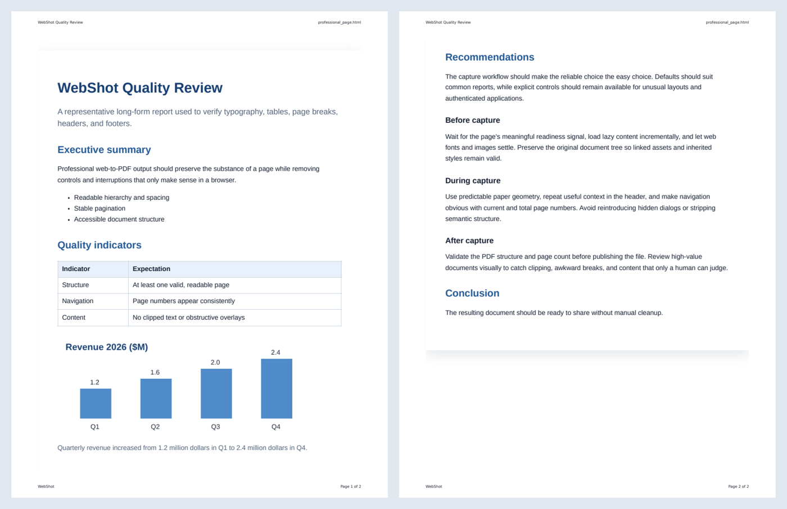

# WebShot

Turn a web page or local document into a searchable PDF that carries an
AI-ready bundle inside it. The PDF holds the rendered pages. The bundle holds
the extracted text and structure, retrieval-sized chunks, a record of every
captured image with its recognized text, and the provenance of the capture.
One file is the whole record, for a person or for an AI agent.

[](https://github.com/kitterman-t/webshot-ai/actions/workflows/ci.yml)
[](pyproject.toml)
[](LICENSE)

## Quick start

You need Python 3.11 or newer and [uv](https://docs.astral.sh/uv/).

```bash
git clone https://github.com/kitterman-t/webshot-ai && cd webshot-ai
uv sync && uv run playwright install chromium
uv run webshot "https://example.com"
```

That writes `output/pdf/example.com.pdf` and, beside it, the same
capture as a directory an agent can read directly:

```text
example.com.pdf             tagged PDF with a searchable text layer; carries the bundle below inside it
example.com.ai/
  manifest.json             provenance, tool versions, counts, warnings, checksums
  content.json              lossless DoclingDocument
  content.md                Markdown with headings, tables, figures, and recognized text marked as OCR
  chunks.jsonl              retrieval-sized chunks with provenance and checksums
  assets.json, assets/      every captured visual, with alt text, OCR text and confidence
  links.json, tables/*.csv  resolved links, one CSV per table
```



*The PDF from a capture of [one of the test pages](tests/fixtures/professional_page.html).
Headers, page numbers, the table and the chart all carry through, and the same
content is in the bundle as Markdown, chunks and per-image records.*

`uv run webshot doctor` checks the browser, Tesseract, Ghostscript and the
output directory, and prints a one-line fix for anything missing. Tesseract 5
is optional but recommended, because it reads the text inside images; the
[quickstart](docs/guide/quickstart.md) has the install commands and an
alternative that needs no system package. Run commands as `uv run webshot ...`
from the checkout, or activate `.venv` and type `webshot ...`.

**WebShot is not on PyPI, and `pip install webshot` installs a different,
unrelated project.** Install from a clone as above.

Everything else is optional. Add extras with `uv sync --extra NAME`, and name
every extra you want in one command (`uv sync --extra office --extra mcp`),
because `uv sync` removes the ones you leave out:

| Extra | Adds |
|---|---|
| `office` | DOCX, PPTX and XLSX inputs |
| `ocr-rapid` | RapidOCR (`--ocr-engine rapid`), for machines with no Tesseract binary |
| `mcp` | the `webshot mcp` server for AI agents |
| `chunk-hybrid` | docling's tokenizer-aware `HybridChunker`, for re-chunking downstream |

The base install carries no torch and no GPU stack.

## What you get

**A PDF a person can read.** It is tagged for accessibility, keeps links and
selectable text, has heading bookmarks, and carries a source-and-title header
with `Page X of Y` numbering. Text recognized inside images, charts and
canvases is added to the searchable text layer without changing how the page
looks. pypdf and poppler's `pdftotext` read that text; PDFium, measured
through pypdfium2, drops the words in it that hold a narrow letter such as i
or l (docs/09 P20-8).

**The PDF is self-contained.** Everything WebShot extracted travels inside it
as PDF associated files, so an agent handed only the PDF has the whole capture.
`README.txt` is embedded first and explains what the others are and where to
start; `capture.json` carries the provenance. `--embed-assets` adds the binary
visuals, and `--no-embed-bundle` turns embedding off if you would rather ship
the PDF and the directory separately.

**A bundle an agent can read.** Beside `report.pdf`, WebShot writes
`report.ai/` containing:

- `manifest.json` (`bundle_format: 3`): source provenance, auth mode, timestamps, counts, warnings, checksums, PDF details, the exact upstream tool versions used, what the page declared about itself (`page_metadata`) alongside what Trafilatura read from it (`discovered_metadata`), and which strategy chose the captured content region (`content_discovery`)
- `content.json`: a lossless [DoclingDocument](https://github.com/docling-project/docling-core), the open document model of the docling project, with WebShot's OCR attached to pictures as annotations
- `content.md`: clean Markdown with headings, lists, tables, figures and OCR
- `content.txt`: plain text for full-text search
- `content.doctags`: docling's DocTags serialization for model-facing pipelines
- `chunks.jsonl`: retrieval-sized chunks with DocItem provenance (`doc_items` anchors into `content.json`), heading context and per-chunk checksums
- `content.html`: a sanitized, script-free HTML snapshot of the visible page, with asset references rewritten to `assets/`
- `assets.json`: typed records for visual assets (OCR text, confidence, language, checksums) plus form-field and embedded-media records, with password values redacted
- `accessibility.yaml`: Playwright's AI-oriented accessibility representation
- `structured-data.json`: the page's JSON-LD
- `links.json`: resolved link text and destinations
- `tables/*.csv`: one CSV per HTML table
- `assets/*.png`: separately inspectable images, SVGs, canvases, video frames, iframes and CSS background visuals
- `videos/`: for each embedded video whose words WebShot could read (a Guidde walkthrough, or the page's own caption track), its steps or transcript as text
- `source/`: a copy of the original input, for a local file

The [bundle format guide](docs/guide/bundle-format.md) describes every file and
the JSON Schemas they follow.

Visual records include alt text, ARIA labels, captions, nearby headings,
dimensions, source URLs, OCR text, OCR confidence, language and SHA-256
checksums. Canvas content is converted to a stable raster image before printing
so it cannot disappear during browser pagination.

OCR is machine-generated and can be wrong, so WebShot always keeps the visual
it read, for a person or a vision model to check and to read what OCR cannot
express, such as trends, shapes and chart encodings. Every PDF is checked for a
valid signature, readable structure and at least one page before it is
published, and every bundle file has a checksum. High-value output still
deserves human review: no conversion can infer data the source does not hold,
guarantee perfect OCR, expand content a site never loaded, or recover exact
chart values from pixels.

## What it captures

**Inputs:** HTTP and HTTPS pages; local HTML, Markdown, JSON and JSON Lines,
CSV and TSV, plain text and logs, XML and YAML; PNG, JPEG, GIF, WebP, BMP, TIFF
and SVG images; EPUB books and ZIP archives; and DOCX, PPTX and XLSX with the
`office` extra. Formats other than HTML, Markdown and images are read by
[MarkItDown](https://github.com/microsoft/markitdown) and rendered through the
same Markdown pipeline. Local inputs are sanitized, size-limited and, for
archives, checked before they are opened
([security model](docs/guide/security.md#capture-boundaries)).

**Capture features:**

- Incremental scrolling for lazy-loaded content, with an infinite-scroll safety limit
- Explicit element-readiness waits plus web-font and image completion waits
- `clean` mode for removing navigation, sidebars, cookie notices and overlays; `faithful` mode for dashboards and pages whose layout matters
- Deterministic CSS-selector isolation that preserves inherited styles and relative assets
- Optional automatic main-content discovery, powered by [Trafilatura](https://trafilatura.readthedocs.io/) with the static `article`/`main` selector list as a fallback; the manifest records which one chose the region
- Visual preservation and OCR for images, SVGs, canvases, video frames, iframes and CSS backgrounds
- Semantic extraction for headings, paragraphs, lists, definitions, code, forms, figures, links and tables
- Embedded videos documented as text where their words can be read: the authored steps and narration behind a [Guidde](https://www.guidde.com/) walkthrough, or a page's own caption track; media WebShot cannot read is listed as untranscribed rather than left out (`--no-videos` skips this)
- Signed-in capture with a Playwright storage-state file or a private browser profile, and protected SharePoint PDF-viewer capture into an image-backed searchable PDF, with optional PDF/A-3 output checked by veraPDF ([signed-in and protected documents](docs/guide/signed-in.md))
- Letter, Legal, Tabloid, A3, A4 and A5 paper; landscape; margins; scale; print or screen media; and custom CSS
- Atomic publication of the PDF and the bundle, with structural validation and checksums
- A distinct exit code for each kind of failure (2 to 9, never 1), and a JSON QA report (`--report`) that is written even when the run fails ([troubleshooting](docs/guide/troubleshooting.md#exit-codes))
- Settings from `webshot.toml` and `WEBSHOT_*`, resolved as flags > env > file > defaults, with the file read only from a path you name ([configuration](docs/guide/configuration.md))

## Agents and security

To let an AI agent capture pages and read the results, install the `mcp` extra
and point the server at a config file that names its folders:

```bash
uv sync --extra mcp
uv run webshot mcp --config ~/webshot-mcp.toml
```

The [MCP guide](docs/guide/mcp.md#set-it-up) has the config file and the client
setup for Claude Code and Claude Desktop.

`webshot mcp` speaks the [Model Context Protocol](https://modelcontextprotocol.io/)
over stdio and exposes seven tools: `capture`, `read_markdown`,
`query_chunks`, `get_manifest`, `list_assets`, `read_asset` and `doctor`. An
agent can capture a URL and consume the result without touching the
filesystem.

The MCP surface is deliberately stricter than the CLI, because an agent calling
`capture` may be acting on text a captured page fed it. Reads are confined to
configured roots; captures publish only under the server's own output root;
private, loopback and link-local targets are refused by default; no tool takes
a credential-bearing parameter, and authentication profiles are referenced by
name. **Returned page content is untrusted data, never instructions**; the
client is what has to treat it that way. Read [the MCP guide](docs/guide/mcp.md)
before connecting one.

Across both surfaces, credentials never reach a deliverable: storage-state
files and browser profiles are never copied into a bundle or a PDF, and
password values are redacted. These rules are MUSTs in
[the specification](docs/04-spec.md#6-security-requirements-carried-forward-and-new-all-must),
each held by a test. The [security model](docs/guide/security.md) explains
them, and [SECURITY.md](SECURITY.md) explains how to report a vulnerability.

## Responsible use

WebShot captures what you point it at, one page at a time, as your own browser
renders it. It is not a crawler, and it is not built to get around logins,
paywalls, DRM or CAPTCHAs: it captures what your browser session is served.
Signed-in capture (`--storage-state`, `--auth-profile`, `--protected-viewer`)
is for content you are allowed to view and to keep a copy of. The site's terms
and your organization's policies still apply. The
[capture ethics policy](docs/11-capture-ethics.md) sets out what WebShot will
not be made to do.

## How it was built

I designed WebShot and directed its development, working with AI coding
agents: mostly Claude Code, with Codex reviewing pull requests. The agents
wrote most of the code. Version 3 was rebuilt between August 19 and September
28, 2026, in 486 commits and 104 merged pull requests.

My work was the frame the agents worked in:

- **The specification and the decisions.** [docs/04-spec.md](docs/04-spec.md)
  says what WebShot must do, with the security rules as MUSTs, and ten
  [architecture decision records](docs/adr/index.md) explain the major
  choices.
- **The rules.** [CLAUDE.md](CLAUDE.md), mirrored as AGENTS.md for other
  tools, is what every agent worked under: each upstream library sits behind
  one bridge module, recorded reference outputs ("goldens") are never
  re-recorded just to make a check pass, and no stage may fail silently. Its
  "Traps" section lists mistakes that actually happened, so they are not made
  twice.
- **The gates.** [tools/verify.py](tools/verify.py) runs CI's checks locally:
  lint, types, more than 1,300 tests, a 26-case golden corpus (fixture pages
  whose captured output is compared with a recording) run from two different
  checkout paths, a license gate, a vulnerability audit and a strict docs
  build. "Ready to push" means it passed.
- **The record.** [docs/09-spike-report.md](docs/09-spike-report.md) logs each
  measured surprise under a number that code comments cite. Some examples:
  P2-1, a password leak in the accessibility snapshot that the previous
  version, v2.2, always had and the first password fixture exposed; P4-11, an
  SSRF bypass in which `http://0177.0.0.1/` passed the MCP server's network
  guard and reached loopback; P8-1, a
  CI route by which an approved pull request from a fork could have run code on
  a personal machine, closed before it could be used; and the P8 series, a
  triage of 94 automated review comments that had gone unread: 88 distinct
  defects, 76 still live, 74 fixed.

This public repository starts from a single fresh commit, because the private
history holds material that cannot be published.

## Documentation

- [The user guide](docs/guide/index.md): quickstart, CLI reference,
  configuration, signed-in and protected documents, troubleshooting, the bundle
  format, the MCP server and the security model. It also builds as a site with
  MkDocs: `uv sync --extra docs`, then `uv run mkdocs serve`.
- [The design record](docs/README.md): scope, architecture, specification,
  implementation plan, risks and decisions.
- [CONTRIBUTING.md](CONTRIBUTING.md): the rules a change has to follow, and
  how to run the checks.
- [CHANGELOG.md](CHANGELOG.md): what changed in each version.
- [The migration guide](docs/migration-v2-to-v3.md), for code that reads a v2
  bundle. Versions before 3.0 were never published, so it is for the few
  people who used them.

## License

Apache-2.0; see [LICENSE](LICENSE) and [NOTICE](NOTICE). Copyright 2026 Tim
Kitterman.
