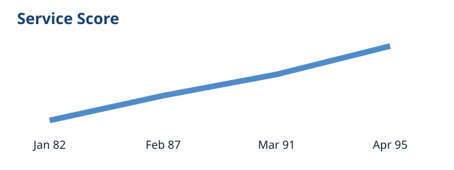

# Quarterly Operations Review

This Markdown document verifies headings, links, tables, code, and relative images.

## Key metrics

| Metric | Q1 | Q2 |
| --- | ---: | ---: |
| Tickets resolved | 1,240 | 1,485 |
| Satisfaction | 92% | 95% |



See the [project documentation](https://example.com/docs) for context.

```json
{"status": "healthy", "regions": 4}
```
